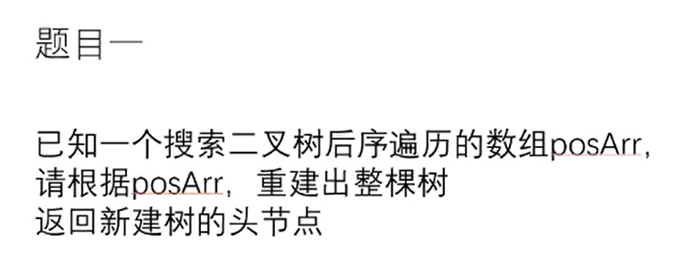
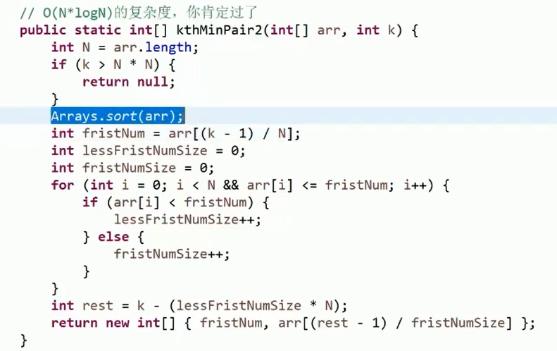
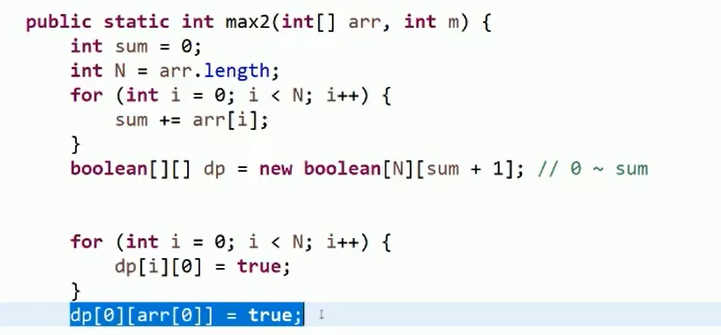

# 搜索二叉树的后序遍历数组还原




> 后序遍历的最后一个是根节点,小于根节点的部分是左子树,大于根节点的部分是右子树
>
> 通过二分法查找查找第一个比根节点小的节点

# 滑动窗口求字串


> count[] 以ASCII方式记录aim中每个字符出现的个数
>
> R 表示滑动窗口的右边下标,R-M 为滑动窗口的左边下标
>
> str 有一个滑动窗口,移动滑动窗口,当出现有 aim 中相同的字符时,则将该字符的 count 减一,减一前判断是否已经小于等于 0 了,如果该字符的count 已经小于等于0了,则将 inValidTimes加一,表示该滑动窗口不满足,当有字符移出滑动窗口时,将该字符的 count加一,并判断是否还原 inValidTimes

# 构造长度为N的数组并返回


> 核心: 奇数+偶数=奇数
>
> 先构造一个成立的数组,将其奇变换(第i个奇数)和偶变换后,拼接到一起的数组依然成立
>
> 求 size 成立的大小,则先求一半成立
>
> 如求7则现求4, 取其奇变换后的4个奇数,再取偶变换后的3个偶数

# 给定数组求其数值对并返回第K小的数值对


> 暴力
>
> 求出每一个数值对再排序


> 优化
>
> 第一个数 firstNum 是可以根据 N 和 k 直接确定的
>
> 第二个数:先得到比 firstNum 小的数的个数 lessFirstNumSize
>
> 再得到等于 firstNum 的数的个数 firstNumSize
>
> 再忽略比 firstNum 小的数生成的数值对,得到 rest
>
> 则第二数为数组中的下标为 (rest-1)/firstNumSize 的数



> 再优化
>
> 通过遍历函数 getMinKthByBFPRT() 可以得到数组中第k小的数(不用排序了)
>
> bfprt算法,解决无序数组中第k小问题(快速选择算法)


# 动态规划

## 不含有重复字符的最长子串的长度


```java
public int lengthOfLongestSubstring(String s) {
    // // 通过Set集合,判断是否有重复的字符
    // Set<Character> occ=new HashSet<Character>();
    // int n=s.length();
    // int rk=-1,ans=0;
    // // i 为左指针,rk为右指针
    // for(int i=0;i<n;++i){
    //     if(i!=0){
    //         // 左指针向右移动,移除之前的字符
    //         occ.remove(s.charAt(i-1));
    //     }
    //     // 右指针不断向右移动,并将字符加入到集合,如果存在相同的字符
    //     // 则不满足条件,跳出循环,开始移动左指针
    //     // set添加成功返回true,如果存在则添加失败,返回false
    //     while(rk+1<n && occ.add(s.charAt(rk+1))){
    //         ++rk;
    //     }
    //     ans=Math.max(ans,rk-i+1);
    // }
    // return ans;

    // 动态规划 100 56.64
    if(s.length()==0){
        return 0;
    }
    char[] chars=s.toCharArray();
    // last[] 记录所有字符上一次出现的位置
    int[] last=new int[256];
    for(int i=0;i<256;i++){
        last[i]=-1;
    }
    last[chars[0]]=0;
    int res=1;
    int preMaxLen=1;
    for(int i=1;i<chars.length;++i){
        preMaxLen=Math.min(preMaxLen+1,i-last[chars[i]]);
        res=Math.max(res,preMaxLen);
        // 记录该字符上一次出现的位置
        last[chars[i]]=i;
    }
    return res;
}
```

## 两个字符串求一类字符


> 如 aaaabb 与 ab 为一类
>
> 用 HashSet 去重,用一个 boolean[] 数组记录是否存在过


> 位图法
>
> 用一个 int 类型的整形的某一位代表一个字符是否出现过

## 非负数组子序列累加和%m后的最大值


> 暴力求解
>
> 求出所有子序列累加和结果,每个数有要和不要两种选择
>
> O(2^n)


> 动态规划
>
> O(n*sum),sum太大时不宜使用
>
> 创建一个bool `dp[n][sum+1]`大小的表格, `dp[5][10]`表示 arr[0...5]随意相加能否得到10
>
> 关键是使用最后一行每一列的值




> 动态规划
>
> 建立一个 bool `dp[N][M-1]` 大小的表 `dp[i][j]` 表示 `arr[0..i]`自由组合 %m 后是否等于 j


>分治
>
>当 arr 的长度N相对不大时,将 arr 分为两半,分别进行暴力求解


# 今日头条


```java
public static class QueryBox2 {
    private Map<Integer, ArrayList<Integer>> map;

    public QueryBox2(int[] arr) {
        map = new HashMap<>();
        // 创建表
        /* 
        	arr=[2,2,3,2,3]
           	2->[0,1,3]
            3->[2,4]
         */
        for (int i = 0; i < arr.length; i++) {
            // 数组中的值位k,下标为value
            if (!map.containsKey(arr[i])) {
                map.put(arr[i], new ArrayList<>());
            }
            map.get(arr[i]).add(i);
        }
    }

    // 查询在[L..R]范围上,有多少个value
    public int query(int L, int R, int value) {
        if (!map.containsKey(value)) {
            return 0;
        }
        List<Integer> indexArr = map.get(value);
        // 查询 < L 的下标有几个
        int a = countLess(indexArr, L);
        // 查询 < R+1 的下标有几个
        int b = countLess(indexArr, R + 1);
        return b - a;
    }

    // 用二分法,找出 <limit 的数有几个
    private int countLess(List<Integer> arr, int limit) {
        int L = 0;
        int R = arr.size() - 1;
        int res = -1;
        while (L <= R) {
            int mid = L + ((R - L) >> 1);
            if (arr.get(mid) < limit) {
                res = mid;
                L = mid + 1;
            } else {
                R = mid - 1;
            }
        }
        return res + 1;
    }
}
```

# 腾讯原题


> 归并排序求逆序对

```java
private static void reversePart(int[] originArr, int left, int right) {
    while (left <= right) {
        int temp = originArr[left];
        originArr[left] = originArr[right];
        originArr[right] = temp;
        left++;
        right--;
    }
}

/**
 * 利用归并排序求逆序对
 * @param originArr
 * @param reverseArr
 * @param power
 * @return
 */
public static int[] reversePair2(int[] originArr, int[] reverseArr, int power) {
    // 拷贝一份originArr
    int[] reverseOriginArr = copyArray(originArr);
    // 反转原始数组
    reversePart(reverseOriginArr, 0, reverseOriginArr.length - 1);
    // 记录升序对的个数
    int[] recordDown = new int[power + 1];
    // 记录降序对的个数
    int[] recordUp = new int[power + 1];
    // 原数组归并排序求降序对
    process(originArr, 0, originArr.length - 1, power, recordDown);
    // 逆序数组归并排序求升序对
    process(reverseOriginArr, 0, reverseOriginArr.length - 1, power, recordUp);

    int[] ans = new int[reverseArr.length];
    for (int i = 0; i < reverseArr.length; i++) {
        int curPower = reverseArr[i];
        for (int p = 1; p <= curPower; p++) {
            int tmp = recordDown[p];
            recordDown[p] = recordUp[p];
            recordUp[p] = tmp;
        }
        for (int p = 1; p <= power; p++) {
            ans[i] += recordDown[p];
        }
    }
    return ans;
}

private static int[] copyArray(int[] originArr) {
    int len=originArr.length;
    int[] ans=new int[len];
    System.arraycopy(originArr, 0, ans, 0, len);
    return ans;
}

//归并排序
private static void process(int[] originArr, int L, int R, int power, int[] record) {
    if (L == R) {
        return;
    }
    int mid = L + ((R - L) >> 1);
    process(originArr, L, mid, power - 1, record);
    process(originArr, mid + 1, R, power - 1, record);
    record[power] += merge(originArr, L, mid, R);
}

private static int merge(int[] arr, int L, int m, int r) {
    int[] help = new int[r - L + 1];
    int i = 0;
    int p1 = L;
    int p2 = m + 1;
    // 记录逆序对个数
    int ans = 0;
    while (p1 <= m && p2 <= r) {
        // 记录逆序对个数
        // 因为每一组是有序的,所以可以一次性求出多个逆序对
        /*
        [2,3] [1,4]
        p1=0 m=1 p2=2
        2>1 所以直接可以得到 3>1
        m-p1+1=2 个逆序对
         */
        ans += arr[p1] > arr[p2] ? (m - p1 + 1) : 0;
        help[i++] = arr[p1] <= arr[p2] ? arr[p1++] : arr[p2++];
    }
    while (p1 <= m) {
        help[i++] = arr[p1++];
    }
    while (p2 <= r) {
        help[i++] = arr[p2++];
    }
    return ans;
}
```

# 给定字符串交换左右部分


> 左边逆序
>
> 右边逆序
>
> 整体逆序

```java
/**
     * 三次逆序
     *
     * @param s
     * @param leftSize
     * @return
     */
public static String rotate1(String s, int leftSize) {
    if (leftSize <= 0 || leftSize >= s.length()) {
        return s;
    }
    return process1(s.toCharArray(), 0, leftSize - 1, s.length() - 1);
}

private static String process1(char[] str, int L, int M, int R) {
    // 左部分逆序
    reverse(str, L, M);
    // 右部分逆序
    reverse(str, M + 1, R);
    // 整体逆序
    reverse(str, L, R);
    return String.valueOf(str);
}

private static void reverse(char[] str, int L, int R) {
    while (L < R) {
        char temp = str[L];
        str[L++] = str[R];
        str[R--] = temp;
    }
}

/**
     * 按长度小的的那边进行交换,交换后小的固定,将长的一边重复
     *
     * @param s
     * @param leftSize
     * @return
     */
public static String rotate2(String s, int leftSize) {
    if (leftSize <= 0 || leftSize >= s.length()) {
        return s;
    }
    char[] str = s.toCharArray();
    // 左边指针
    int L = 0;
    // 右边指针
    int R = str.length - 1;
    // 左部分长度
    int lPart = leftSize;
    // 右部分长度
    int rPart = str.length - leftSize;
    // 得到较小的长度
    int same = Math.min(lPart, rPart);
    // 左右长度之差
    int diff = lPart - rPart;
    // 按较小的长度交换
    exchange(str, L, R, same);
    while (diff != 0) {
        // diff 大于0 说明左侧大,L跳转
        // 新的左侧部分为diff个
        if (diff > 0) {
            L += same;
            lPart = diff;
        } else {
            R -= same;
            rPart = -diff;
        }
        same = Math.min(lPart, rPart);
        diff = lPart - rPart;
        exchange(str, L, R, same);
    }
    return String.valueOf(str);
}

// str[L..] 数size大小 str[..R]数size大小 交换
private static void exchange(char[] str, int L, int R, int size) {
    int i = R - size + 1;
    char tmp = 0;
    while (size-- != 0) {
        tmp = str[L];
        str[L] = str[i];
        str[i] = tmp;
        L++;
        i++;
    }
}
```

# 京东原题


```java
public static int ways1(int[] arr) {
    int N = arr.length;
    if (arr[N - 1] != 0) {
        return process1(arr, N - 1, arr[N - 1], 2);
    } else {
        int ways = 0;
        for (int v = 1; v < 201; v++) {
            // 判断最后一个数 1~200 的情况
            // 因为是最后一个数,所以只能是前一个数大于等于它
            ways += process1(arr, N - 1, v, 2);
        }
        return ways;
    }
}

/*
	根据 i 和 i+1 的关系得到 i-1 和 i 的值
    如果 i 位置的数字变为 v
    并且 arr[i] 和 arr[i+1] 的关系为 s
    s==0 代表 arr[i] < arr[i+1]
    s==1 代表 arr[i] = arr[i+1]
    s==2 代表 arr[i] > arr[i+1]
    返回 arr[0...i] 有多少种转化方式
     */
private static int process1(int[] arr, int i, int v, int s) {
	
    if (i == 0) {
        return ((s == 0 || s == 1) && (arr[i] == 0 || v == arr[i])) ? 1 : 0;
    }

    // arr[i]!=0 说明数没丢
    if (arr[i] != 0 && v != arr[i]) {
        return 0;
    }
    // i>0 且 arr[i]可以变成v
    int ways = 0;
    // arr[i] <= arr[i+1]
    if (s == 0 || s == 1) {
        for (int pre = 1; pre < 201; pre++) {
            ways += process1(arr, i - 1, pre, pre < v ? 0 : (pre == v ? 1 : 2));
        }
    }
    // 前一个数只能大于v了
    // pre 从 v 开始
    // arr[i] > arr[i+1]
    else {
        for (int pre = v; pre < 201; pre++) {
            ways += process1(arr, i - 1, pre, pre < v ? 0 : (pre == v ? 1 : 2));
        }
    }
    return ways;
}
```

# 字节高频

## 转换随机函数


> 任何一个随机函数都可以改为 生成 0,1的随机函数
>
> 将0,1看成二进制的某一位,即可等概率返回任何数字
>
> 1,2 返回0	4,5 返回1	3重新生成
>
> 1~7 需要先生成 0~6 ,需要三位二进制
>
> 所以将随机函数先随机三次生成一个三位的二进制
>
> 三位二进制可以表示 0~7,所以当三位二进制表示为7时,重新随机
>
> 一切皆可二进制

```java
public static class RandomBox {
    private final int min;
    private final int max;

    public RandomBox(int min, int max) {
        this.min = min;
        this.max = max;
    }

    /*
    10~15
    10+[0,5]
     */
    public int random() {
        return min + (int) (Math.random() * (max - min + 1));
    }

    public int getMin() {
        return min;
    }

    public int getMax() {
        return max;
    }

    // 利用随机函数等概率生成 0和1
    public static int rand01(RandomBox randomBox) {
        // 例如 10~15
        // 10
        int min = randomBox.getMin();
        // 15
        int max = randomBox.getMax();
        // 6
        int size = max - min + 1;
        // 判断 size 是否为奇数
        // odd 奇数
        boolean odd = (size & 1) != 0;
        // 3
        int mid = size / 2;
        int ans = 0;
        do {
            // 随机一个值
            // 如 12 - 10 = 2
            ans = randomBox.random() - min;
        } while (odd && ans == mid);    // 如果如果ans为3则再次随机
        // 生成 0 或 1
        return ans < mid ? 0 : 1;
    }

    // 随机机制 randomBox
    // 等概率返回 from~to
    public static int random(RandomBox randomBox, int from, int to) {
        if (from >= to) {
            return from;
        }
        int range = to - from;
        int num = 1;
        // 求 0~range 需要几个2进制位
        while ((1 << num) - 1 < range) {
            num++;
        }
        // 最终的累加和
        int ans = 0;
        do {
            ans = 0;
            for (int i = 0; i < num; i++) {
                ans += (rand01(randomBox) << i);
            }
        } while (ans > range);
        return ans + from;
    }
}

public static void main(String[] args) {
    RandomBox randomBox = new RandomBox(11, 20);
    Map<Integer, Integer> map = new HashMap<>();
    for (int i = 0; i < 50000; i++) {
        int random = RandomBox.random(randomBox, 10, 30);
        if (map.containsKey(random)) {
            map.replace(random, map.get(random) + 1);
            continue;
        }
        map.put(random, 1);
    }

    map.forEach((k, v) -> {
        System.out.println(k + ":" + v);
    });
}
```


```java
public static class RandomBox {
    private final double p;

    // 初始化时一定满足 0 < zeroP < 1
    public RandomBox(double zeroP) {
        this.p = zeroP;
    }

    // p 概率返回0
    // 1-p 返回1
    public int random() {
        return Math.random() < p ? 0 : 1;
    }

    // 底层依赖一个以 p 概率返回0,以 1-p 概率返回1的随机函数rand01
    // 如何加工出等概率返回0和1的函数
    public static int rand01(RandomBox randomBox) {
        // 随机两次
        // 01 => 0
        // 10 => 1
        int num1;
        int num2;
        do {
            num1 = randomBox.random();
            num2 = randomBox.random();
        } while (num1==num2);
        if(num1==1 && num2==0){
            return 1;
        }
        return 0;
    }


}

public static void main(String[] args) {
    RandomBox randomBox = new RandomBox(0.9);
    Map<Integer, Integer> map = new HashMap<>();
    for (int i = 0; i < 500000; i++) {
        int ret = RandomBox.rand01(randomBox);
        if (map.containsKey(ret)) {
            map.replace(ret, map.get(ret) + 1);
            continue;
        }
        map.put(ret, 1);
    }

    map.forEach((k, v) -> {
        System.out.println(k + ":" + v);
    });
}
```

## 候选和血量一次删除多个不同的数


```java
/**
 * 数组长度为N
 * 找出数组中数的个数大于 N/2 的数
 * 时间 O(N) 空间 O(1)
 * <p>
 * 解法:空间 O(1) 说明不能使用哈希表
 * 一次删除两个不同的数
 * 会出现 一个数也不剩 和 剩余一种数 两种情况
 * 判断剩余的那个数是否满足条件即可
 */
public static int solution(int[] nums) {
    // 候选
    int cand = 0;
    // 血量
    // HP==0 没有候选
    int HP = 0;
    // 遍历一遍数组 nums , 一次删掉两个不同的数
    // 哪个数剩下来,那个数就是 cand
    for (int i = 0; i != nums.length; ++i) {
        if (HP == 0) {
            // 如果没有候选,将当前的数置为候选,并给他一点血量
            cand = nums[i];
            HP = 1;
        } else if (nums[i] == cand) {
            // 当前数和候选数相同
            // HP++
            HP++;
        } else {
            // 存在候选,当前数与候选不同
            // HP--
            // 这相当于将当前数和候选删除
            HP--;
        }
    }
    if (HP == 0) {
        return -1;
    }
    HP = 0;
    for (int i = 0; i != nums.length; ++i) {
        if (nums[i] == cand) {
            HP++;
        }
    }
    return HP > nums.length / 2 ? cand : -1;
}
```


```java
/**
 * <h3>一次删除 K 个不同的数</h3>
 * 返回数组中哪些数的次数大于 N/K 的数
 * <p>
 * 说明最多有 K-1 个这样的数,否则数组数大于 N
 * <p>
 * 立 K-1 个候选,如果候选够了,当出现与候选不同的数时
 * <p>
 * 所有候选付出一点血量
 * <br>
 * 血量为0不再为候选
 */
public static List<Integer> solution2(int[] nums, int K) {
    List<Integer> ans = new ArrayList<>();
    if (K < 2) {
        return ans;
    }
    // 候选哈希表
    Map<Integer, Integer> cands = new HashMap<>();
    for (int i = 0; i < nums.length; i++) {
        if (cands.containsKey(nums[i])) {
            // 与候选数相同,血量加1
            cands.put(nums[i], cands.get(nums[i]) + 1);
        } else {
            // 与候选数不同,且候选数已经为 K-1
            if (cands.size() == K - 1) {
                // 所有候选数的血量减一
                allCandsMinusOne(cands);
            } else {
                cands.put(nums[i], 1);
            }
        }
    }
    // 判断剩余的候选是否满足条件
    // getReals() 得到候选表中的每一个key真实存在的次数
    Map<Integer, Integer> reals = getReals(nums, cands);
    for (Map.Entry<Integer, Integer> set : cands.entrySet()) {
        Integer key = set.getKey();
        if (reals.get(key) > nums.length / K) {
            ans.add(key);
        }
    }
    return ans;
}

private static Map<Integer, Integer> getReals(int[] nums, Map<Integer, Integer> cands) {
    Map<Integer, Integer> reals = new HashMap<>();
    for (int curNum : nums) {
        if (cands.containsKey(curNum)) {
            if (reals.containsKey(curNum)) {
                reals.put(curNum, reals.get(curNum) + 1);
            } else {
                reals.put(curNum, 1);
            }
        }
    }
    return reals;
}

private static void allCandsMinusOne(Map<Integer, Integer> cands) {
    // 定义一个临时数组用于保存要删除的key
    List<Integer> removeList = new LinkedList<>();
    for (Map.Entry<Integer, Integer> set : cands.entrySet()) {
        Integer key = set.getKey();
        Integer value = set.getValue();
        // 如果当前血量为1,说明要删除该key
        if (value == 1) {
            removeList.add(key);
        }
        cands.put(key, value - 1);
    }
    for (Integer removeKey : removeList) {
        cands.remove(removeKey);
    }
}
```

## 返回二维数组中1数量最多的行


```java
public static List<Integer> longestOnes1(int[][] matrix) {
    int N = matrix.length;
    int M = matrix[0].length;
    List<Integer> ans = new ArrayList<>();
    // 1 的长度
    int maxLen = 0;
    // 从右上角开始
    for (int i = 0; i < N; i++) {
        int j = M;
        // 遍历,直到非1
        while (j > 0 && matrix[i][j - 1] == 1) {
            j--;
        }
        // M-j 为1的长度
        if (maxLen < M - j) {
            maxLen = M - j;
            ans.clear();
        }
        if (maxLen == M - j) {
            ans.add(i);
        }
    }
    return ans;
}

// 优化,使用二分法求1的长度
public static List<Integer> longestOnes2(int[][] matrix) {
    int N = matrix.length;
    int M = matrix[0].length;
    List<Integer> ans = new ArrayList<>();
    int maxLen = 0;
    for (int i = 0; i < N; i++) {
        int temp = 0;
        int left = 0;
        int right = M - 1;
        while (left <= right) {
            int mid = left + ((right - left) >> 1);
            if (matrix[i][mid] == 1) {
                temp = Math.max(temp, M - mid);
                right = mid - 1;
            } else {
                left = mid + 1;
            }
        }
        if (maxLen < temp) {
            maxLen = temp;
            ans.clear();
        }
        if (maxLen == temp) {
            ans.add(i);
        }
    }
    return ans;
}

private static int mostLeftOne(int[] arr, int L, int R) {
    int ans = R + 1;
    int M = 0;
    while (L <= R) {
        M = L + ((R - L) >> 1);
        if (arr[M] == 1) {
            ans = M;
            R = M - 1;
        } else {
            L = M + 1;
        }
    }
    return ans;
}

public static List<Integer> longestOnes3(int[][] matrix) {
    int N = matrix.length;
    int M = matrix[0].length;
    List<Integer> ans = new ArrayList<>();
    int maxLen = 0;
    for (int i = 0; i < N; i++) {
        // 每次二分都是 0~M-1 开始
        int j = mostLeftOne(matrix[i], 0, M - 1);
        if (maxLen < M - j) {
            maxLen = M - j;
            ans.clear();
        }
        if (maxLen == M - j) {
            ans.add(i);
        }
    }
    return ans;
}

public static List<Integer> longestOnes4(int[][] matrix) {
    int N = matrix.length;
    int M = matrix[0].length;
    List<Integer> ans = new ArrayList<>();
    int maxLen = 0;
    int col = M;
    for (int i = 0; i < N; i++) {
        // 从0到col-1 寻找有没有新的1
        // 每次缩小二分范围
        col = mostLeftOne(matrix[i], 0, col - 1);
        if (maxLen < M - col) {
            maxLen = M - col;
            ans.clear();
        }
        if (matrix[i][col] == 1) {
            ans.add(i);
        }
    }
    return ans;
}
```

# 美团现场


```java
// 使用两个变量,记录第一行或是第一列是否要变0
// 遍历其余元素
// 若是0,则将其第一行和第一列的元素改为0
// 最后通过第一行和第一列的0做延伸
public static void setZeroes1(int[][] matrix) {
    boolean row0Zero = false;
    boolean col0Zero = false;
    int i = 0;
    int j = 0;
    for (i = 0; i < matrix[0].length; i++) {
        if (matrix[0][i] == 0) {
            row0Zero = true;
            break;
        }
    }
    for (i = 0; i < matrix.length; i++) {
        if (matrix[i][0] == 0) {
            col0Zero = true;
            break;
        }
    }
    for (i = 1; i < matrix.length; i++) {
        for (j = 1; j < matrix[0].length; j++) {
            if (matrix[i][j] == 0) {
                matrix[i][0] = 0;
                matrix[0][j] = 0;
            }
        }
    }
    for (i = 1; i < matrix.length; i++) {
        for (j = 1; j < matrix[0].length; j++) {
            if (matrix[i][0] == 0 || matrix[0][j] == 0) {
                matrix[i][j] = 0;
            }
        }
    }
    if (row0Zero) {
        for (i = 0; i < matrix[0].length; i++) {
            matrix[0][i] = 0;
        }
    }
    if (col0Zero) {
        for (i = 0; i < matrix.length; i++) {
            matrix[i][0] = 0;
        }
    }
}

public static void setZeroes2(int[][] matrix) {
    // 记录第1列是否要变为0
    boolean col0 = false;
    int i = 0;
    int j = 0;
    for (i = 0; i < matrix.length; i++) {
        for (j = 0; j < matrix[0].length; j++) {
            if (matrix[i][j] == 0) {
                // 将变0的信息存储在第一列中
                matrix[i][0] = 0;
                if (j == 0) {
                    // 如果第一列中出现0,则将col0设为true
                    col0 = true;
                } else {
                    // 将变0的信息存储在第一行中
                    matrix[0][j] = 0;
                }
            }
        }
    }
    // 大循环从下往上,因为需要保证第一行最后改变
    for (i = matrix.length - 1; i >= 0; i++) {
        for (j = 1; j < matrix[0].length; j++) {
            if (matrix[i][0] == 0 || matrix[0][j] == 0) {
                matrix[i][j] = 0;
            }
        }
    }
    if (col0) {
        for (i = 0; i < matrix.length; i++) {
            matrix[i][0] = 0;
        }
    }
}
```

